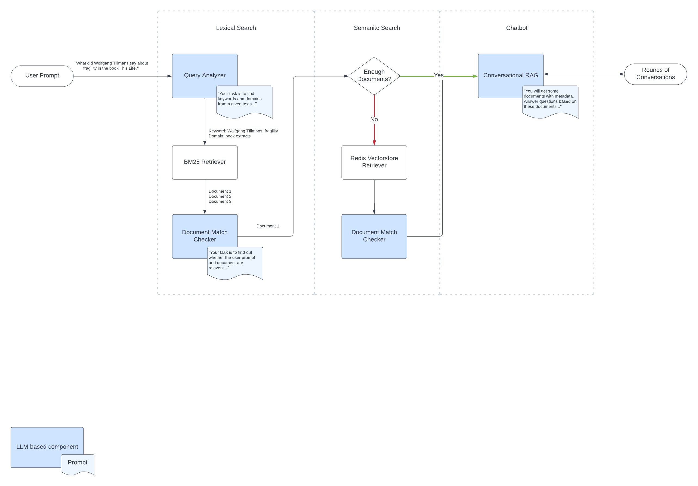

##### 👉 Checkout full documentation on my [🤗 Space](https://huggingface.co/spaces/fyang0507/my-notion-companion)

# My Notion Companion 🤖
###### A conversational RAG that helps to chat with my (mostly Chinese-based) Notion Databases.

My Notion Companion is a LLM-powered conversational RAG to chat with documents from Notion.
It uses hybrid search (lexical + semantic) search to find the relevant documents and a chat interface to interact with the docs.
It uses only **open-sourced technologies** and can **run on a single Mac Mini**.

### Empowering technologies
- **The Framework**: uses [Langchain](https://python.langchain.com/docs/)
- **The LLM**: uses 🤗-developed [`HuggingFaceH4/zephyr-7b-beta`](https://huggingface.co/HuggingFaceH4/zephyr-7b-beta). It has great inference speed, bilingual and instruction following capabilities
- **The Datastores**: the documents were stored into both conventional lexical data form and embeeding-based vectorstore (uses [Redis](https://python.langchain.com/docs/integrations/vectorstores/redis))
- **The Embedding Model**: uses [`sentence-transformers/distiluse-base-multilingual-cased-v1`](https://huggingface.co/sentence-transformers/distiluse-base-multilingual-cased-v1). It has great inference speed and bilingual capability
- **The Tokenizers**: uses 🤗's [`AutoTokenizer`](AutoTokenizer) and Chinese text segmentation tool [`jieba`](https://github.com/fxsjy/jieba) (only in lexical search)
- **The Lexical Search Tool**: uses [`rank_bm25`](https://github.com/dorianbrown/rank_bm25)
- **The Computing**: uses [LlamaCpp](https://github.com/ggerganov/llama.cpp) to power the LLM in the local machine (a Mac Mini with M2 Pro chip)
- **The Observability Tool**: uses [LangSmith](https://docs.smith.langchain.com/)
- **The UI**: uses [Streamlit](https://docs.streamlit.io/)

### What's wrong with Notion's native search?
As much as I've been a very loyal (but freemium) Notion user, search func in Notion **sucks**. It supports only discrete keyword search with exact match (e.g. it treats Taylor Swift as two words).

What's even worse is that most of my documents are in Chinese. Most Chinese words consist of multiple characters. If you break them up, you end up with a total different meaning ("上海"=Shanghai, "上"=up,"海"=ocean).

My Notion Compnion is here to help me achieve two things:
- to have an improved search experience across my notion databases (200+ documents)
- to have a conversation with my Notion documents in natural language

### The system design

See more detailed evaluation and documentation on [Fred's 🤗 space](https://huggingface.co/spaces/fyang0507/my-notion-companion)!

### Quickstart
##### Step 1: Install tools required
The following tools is required to set up the environments:
1. Conda/Mamba package manager. I used [Micromamba](https://mamba.readthedocs.io/en/latest/user_guide/micromamba.html). Once you have the right distribution, create the virtual env with the provided `env.yml`
2. LlamaCpp: to enable GPU acceleration, llamacpp has to be installed separately. See the [langchain instruction](https://python.langchain.com/docs/guides/local_llms#llama.cpp) to set up llamacpp in the virtual environment
3. Redis stack server. Follow the [Redis guide](https://redis.io/docs/install/install-stack/mac-os/) to set up

##### Step 2: Download the LLM
LlamaCpp accepts any `gguf` binary model files. These files can generally be found in Hugging Face searching `model_name.gguf`. You can choose one you like, but for running on a single machines, I suggest with models <=7B params and a quantized version.

##### Step 3: Create and specify various configurations
- create new `.token.toml` to specify (in key-value pair) the needed tokens for [notion](https://www.notion.so/my-integrations) and [hugging face](https://huggingface.co/settings/tokens). You will need to generate them on their website
- create new `.env` (if you want to use LangSmith as observability tool, see their [guide](https://docs.smith.langchain.com/tracing/quick_start), again you need to generate a token on their website)
- create new `.notion_databases.toml`, you need to specify (in key-value pair) the databases you want to download, see the [langchain guide](https://python.langchain.com/docs/integrations/document_loaders/notiondb)
- in `.config.toml`, change the `model_path, model_name, model_mapping, embedding_model, redis_schema` params according to the downloaded and used models

##### Step 4: Your chatbot is waiting for you!
run `bash run.sh` to start the notion companion! Enjoy chatting!

### References
- [Working Log](https://fredyang0507.notion.site/MyNotionCompanion-ce12513756784d2ab15015582538825e?pvs=4)
- [Feature Tracker](https://fredyang0507.notion.site/306e21cfd9fa49b68f7160b2f6692f72?v=789f8ef443f44c96b7cc5f0c99a3a773&pvs=4)
